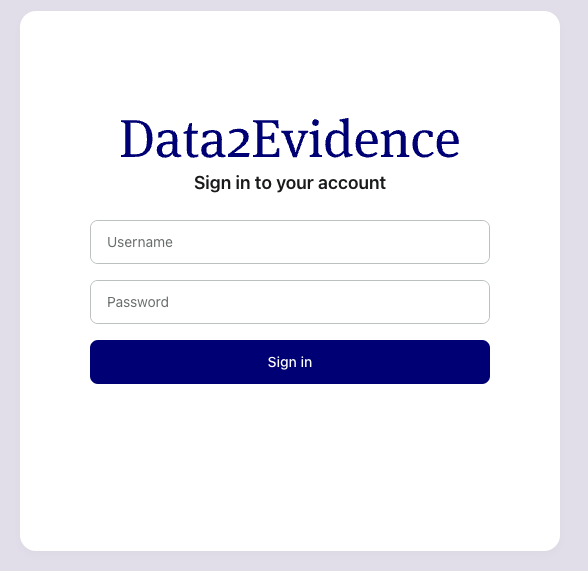
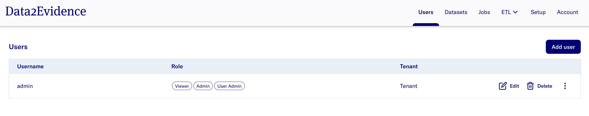

# Data2Evidence Documentation

[](https://github.com/data2evidence/d2e/actions/workflows/az-dc-cd.yml) &nbsp;&nbsp; [](https://github.com/data2evidence/d2e/actions/wosrkflows/docker-push.yml) &nbsp;&nbsp; [](https://github.com/data2evidence/d2e/actions/workflows/docker-compose-up.yml)

The following documentation outlines the basic setup of Data2Evidence for users who want to use the software.

# Getting Started

## Pre-requisites

- Install pre-requisite softwares for running D2E. Refer to the installation guide [here](./docs/1-setup/README.md).
- Install the d2e cli client by run the command in your terminal:

```bash
npm install -g https://github.com/data2evidence/d2e/releases/download/latest/data2evidence-cli.tgz
```

- note: run the above command with `sudo` if permission denied

## Environment Variables and Credentials Setup

- Create directory to store d2e configuration files and go to it. Please note that subsequent commands need to be executed in the directory:

```bash
mkdir d2e
cd d2e
```

- Generate `.env` file with the environment variables (Refer [here](./docs/1-setup/environment-variables.md) for more information on the environment variables generated). It is required to set the `GH_USERNAME` and `GH_TOKEN` environment variables to run the command (see [here](./docs/1-setup/README.md) for instructions how to generate the `GH_TOKEN`).

```bash
GH_USERNAME=$GH_USERNAME GH_TOKEN=$GH_TOKEN d2e genenv
```

- Login to docker registry to retrieve resources to run D2E.

```bash
d2e login
```

- Initialize D2E:

```bash
d2e init
```

## Application Setup

Naviage to the folder where d2e repo is downloaded. Run the folllowing:

- Run the command to get the neccessary docker images and run D2E:

```bash
d2e start
```

**Note:**

- If you are starting the application for first time and/or if docker volume resources have been completely removed, re-run the **Environment Variables and Credentials Setup** section
- If you have setup the application before, run steps in section **Application Setup** as required.

## Authentication Portal

- Input the URL https://localhost:41100/portal into a Chrome web browser. A ["**Proceed to localhost**"](docs/images/chrome/chrome-proceed-to-localhost.png) display is expected.
- Select **Advanced** > **Proceed to localhost (unsafe)**

> **The expected display is:**
>
> 

## Accessing Admin Portal

The Admin Portal allows authorized personnel to login and perform the management of users, datasets and job plugins.

- Login as Admin with following credentials:

  - username - `admin`
  - password - `Updatepassword12345`

- Click on **Account** on the top right > **Switch to admin portal**

> **The expected display is:** > 

Additional info:

- [Performing password change](./docs/2-load/1-initial-admin.md)
- [Performing user management](./docs/2-load/2-users-roles.md)

> Tip: For quick access to the Admin Portal, input URL https://localhost:41100/portal/systemadmin/user-overview in the search bar.

## Configure D2E

Please find information how to add dataset and configure D2E [here](./docs/2-load/README.md)

## Researcher Portal

### Cohort Creation

- Navigate to [Researcher Portal](https://localhost:41100/portal/researcher) and select **Cohort** tab.
- Refer to the [documentation here](./docs/3-configure/8-cohort.md) for more details.

## Stopping Application

1. Stop all containers: `d2e stop`
2. Perform clean-up: `d2e clean`
   - **WARNING**: This step removes all containers and volumes. You would need to re-run the [Environment Variables and Credentials](#environment-variables-and-credentials-setup) section for a fresh startup.
