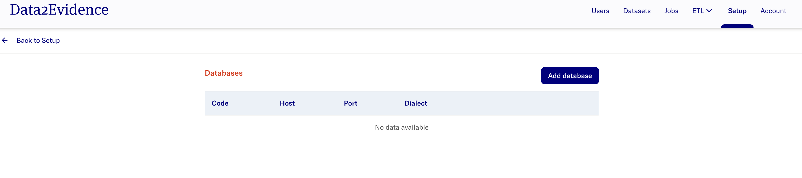

# Analytics Platform Documentation (D2E)

[](https://github.com/alp-os/d2e/actions/workflows/az-dc-cd.yml) &nbsp;&nbsp; [](https://github.com/alp-os/d2e/actions/wosrkflows/docker-push.yml) &nbsp;&nbsp; [](https://github.com/alp-os/d2e/actions/workflows/docker-compose-up.yml)

The following documentation outlines the basic setup of Analytics Platform (D2E) for users who require the software.

# Getting Started 
## Pre-requisites
- Install pre-requisite softwares for running D2E. Refer to the installation guide [here](./1-setup/README.md). 
- Install the d2e cli client by using the command in your terminal: 
```bash
npm install -g https://github.com/data2evidence/d2e/releases/download/latest/data2evidence-cli.tgz
```

## Environment Variables and Credentials Setup 
- Generate environment variables (Refer [here](./1-setup/environment-variables.md) for more information on the environment variables generated)
```bash
d2e genenv
```

- Login to docker registry to retrieve resources to run D2E.
```bash
d2e login
```

- Initialize D2E: 
```bash
d2e init
```

## Application Setup

Naviage to the folder where d2e repo is downloaded. Run the folllowing: 
- Run the command to get the neccessary docker images and run D2E: 

```bash
d2e start
```

**Note:**
- If you are starting the application for first time and/or if docker volume resources have been completely removed, re-run the **Environment Variables and Credentials Setup** section
- If you have setup the application before, run steps in section **Application Setup** as required.

# D2E Guide 
## Authentication Portal
- Input the URL https://localhost:41100/portal into a Chrome web browser. A ["**Proceed to localhost**"](docs/images/chrome/chrome-proceed-to-localhost.png) display is expected.
- Select **Advanced** > **Proceed to localhost (unsafe)**

> **The expected display is:** 
>
> 

## Accessing Admin Portal
The Admin Portal allows authorized personnel to login and perform the management of users, datasets and job plugins. 

- Login as Admin with following credentials:
  - username - `admin`
  - password - `Updatepassword12345`

- Click on **Account** on the top right > **Switch to admin portal**

> **The expected display is:**
> 


Additional info:
- [Performing password change](./2-load/1-initial-admin.md)
- [Performing user management](./2-load/2-users-roles.md)

> Tip: For quick access to the Admin Portal, input URL https://localhost:41100/portal/systemadmin/user-overview in the search bar.

## Adding Existing Databases

This sections assumes that there is an existing database available. The database should be in a Postgres docker container name or external database with a Fully Qualified Domain Name (FQDN).


- In the Admin Portal, navigate to **Setup** > **Databases** > **Configure** > **Add database**
  > **The expected display is:** 
- Select **Add database** and provide the database information accordingly. 
- Please refer to [documentation here](./2-load/4-setup-db-credentials.md) for more details on the input parameters for database creation.
  >**The expected result after adding a database is:** 
- Perform a restart of the system for new connection details to be provisioned to the data services using the command: 

```bash
yarn start:minerva --force-recreate; sleep 60
```

If there is no existing databases available, you may consider using the following sample database below and continue with the guide from section [Plugins](#plugins) onwards.
- [Synthetic Public Use Files (SynPUFs)](./2-load/): Perform sub-steps [3](./2-load/3-setup-pg-permissions.md), [4](./2-load/4-setup-db-credentials.md), [6](./2-load/6-load-synpuf1k.md) and [7](./2-load/7-load-vocab.md)
- broadsea-atlasdb: Refer to the docs [here](/docs/2-load/8-load-broadsea.md)

## Plugins 
The Admin portal allows the admin user to manage plugins in the platform, for instance installation, version updates and uninstallation of plugins. 
- In the Admin Portal, navigate to **Setup** > **Plugins** > **Configure**
  >**The expected display is:**


## Jobs Portal
The Admin portal allows the admin user to perform customized and scheduled job runs from [plugins](#plugins) that have been installed.

- In the Admin Portal, navigate to **Jobs** and select the **Jobs** tab.
> **The expected display is**: 

- Select the `⋮` icon to perform the respective job functions. 
- Select **Job Runs** tab to get the job run status.

## Creating Datasets
- In the Admin Portal, navigate to **Datasets** > **Add dataset**
  >**The expected display is:**

- Provide the dataset [parameters](./3-configure/1-create-dataset.md) accordingly.
  > **The expected result upon successful addition of dataset**: 

## Dataset Permissions
The Admin Portal allows the admin to perform dataset management to provide users with permissions for selected datasets. 
- In the Admin Portal, navigate to **Datasets**. 
- Navigate to the dataset you wish to provide/revoke permission access for users. 
- Under **Actions** dropdown, select **Permissions** to view users who have requested for access or provide access to existing users. 
- Refer to the [documentation here](./3-configure/2-dataset-permissions.md) for a detailed guide on setting permissions.


## Platform Configuration

### Generating Data Quality Dashboard (DQD)
This section generates the Data Quality Dashboard based on the dataset of interest. 
- In the Admin Portal, navigate to **Datasets**. Navigate to the dataset of interest and click **Select Action**. 
- Select **Run data quality** and select the **Run Analysis** button. 
- Repeat the step for **Run data characterization**.
- After completing the **Data Quality** and **Data Characterization** job runs,  section, refer to the [documentation here](./3-configure/4-dqd-dashboard.md) to access the Data Quality Dashboard for the respective datasets in the Researcher portal.

  > **The expected result is:** 

### Create Cache
This section provides the steps for setting up the analytics environment.
- Navigate to the dataset of interest and click **Select Action**. 
- Select **Create cache**.
- Refer to the [documentation here](./3-configure/5-create-duckdb-file.md) to create cache via the Jobs Portal.

### Update Datasets Metadata 
- In the Admin Portal, navigate to **Datasets** tab and select **Update dataset metadata**. 
- Refer to the [documentation here](./3-configure/7-fetch-datasets-metadata.md) for more details.

**The expected result is as follows:**
>
>

## Researcher Portal
### Cohort Creation
- Navigate to [Researcher Portal](https://localhost:41100/portal/researcher) and select **Cohort** tab.
- Refer to the [documentation here](./3-configure/8-cohort.md) for more details.

## Stopping Application
1. Stop all containers: `yarn stop:minerva`
2. Perform clean-up: `yarn clean:minerva`
    - **WARNING**: This step removes all containers and volumes. You would need to re-run the [Environment Variables and Credentials](#environment-variables-and-credentials-setup) section for a fresh startup. 


# D2E Support
