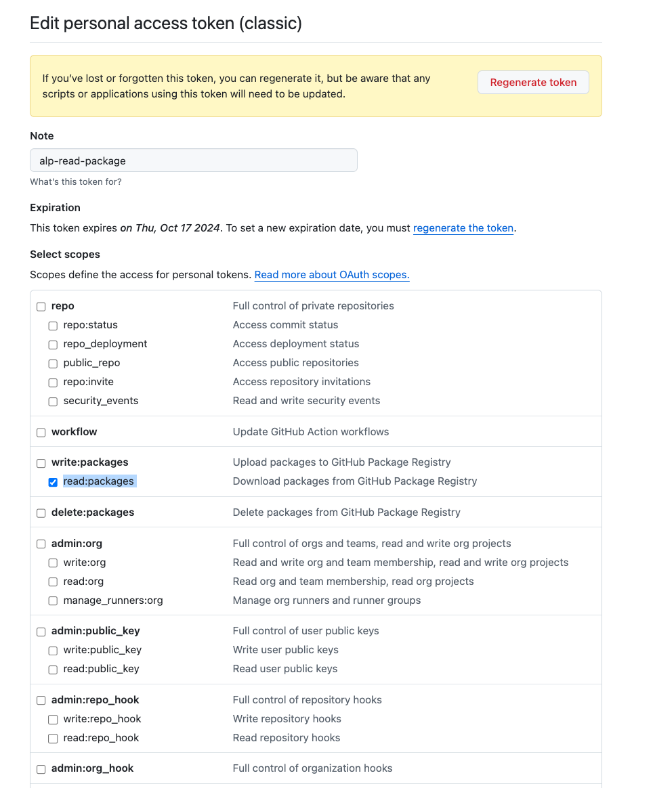

# User Credentials & Environment Variables

- GitHub Username & PAT Token are required to fetch images from docker registry `ghcr.io`

## GitHub Username (GH_USERNAME)

### GUI

- open: https://github.com/settings > select _Go to your personal profile_

### CLI

- with GitHub cli (optional)

```bash
gh api user -q .login
```

## GitHub PAT token (GH_TOKEN)

- Generate a GitHub PAT (classic) token with scope `read:packages` to retrieve packages to run d2e.
- See: Setting up GitHub PAT: [link](https://docs.github.com/en/authentication/keeping-your-account-and-data-secure/managing-your-personal-access-tokens#creating-a-personal-access-token-classic)
- open https://github.com/settings/tokens/new?description=d2e%20GH_TOKEN%20(read:packages)&scopes=read:packages
- Select scope: `read:packages`

Example:


- GitHub PAT token via CLI seems currently not supported - https://github.com/cli/cli/issues/2531

# Installation pre-requisites

Tested platforms:

- Ubuntu
- macos

Untested platforms:

- Other linux
- [Windows Services for Linux (WSL)](https://learn.microsoft.com/en-us/windows/wsl/install)

## Homebrew

- macos package manager

### macos

- https://brew.sh

```
/bin/bash -c "$(curl -fsSL https://raw.githubusercontent.com/Homebrew/install/HEAD/install.sh)"
```

## Docker

- see: https://docs.docker.com/engine/install/

### ubuntu

- see: https://docs.docker.com/engine/install/ubuntu/

### macos

- see: https://docs.docker.com/desktop/setup/install/mac-install/

### Enable file-sharing

- see: https://docs.docker.com/desktop/settings-and-maintenance/settings/#file-sharing
- Steps: Go to Docker Desktop > Resources > File Sharing > Add /opt/homebrew/lib/node_modules/

## nodejs

- https://nodejs.org/en/download/package-manager
- version 18 is required

### ubuntu

- https://nodejs.org/en/download

```bash
curl -o- https://raw.githubusercontent.com/nvm-sh/nvm/v0.40.1/install.sh | bash
nvm install 18
```

### macos

- https://formulae.brew.sh/formula/node@18

```bash
brew install node@18
```

- alternatively, see: https://nodejs.org/en/download

## yarn

- https://classic.yarnpkg.com/lang/en/docs/install

```bash
npm install --global yarn
```

## openssl

- openssl version 3 is required

### macos

- https://formulae.brew.sh/formula/openssl@3

```bash
brew install openssl@3
```

## git

- see: https://github.com/git-guides/install-git

### ubuntu

```bash
sudo apt-get update
sudo apt-get install git-all
```

### macos

```bash
brew install git
```
