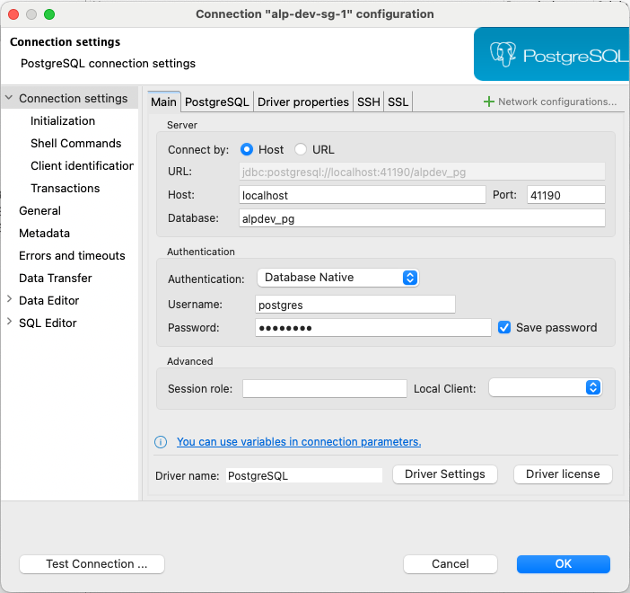

# DBeaver
- Universal database tool and SQL client
- https://dbeaver.io/
## macos
- https://formulae.brew.sh/cask/dbeaver-community
```
brew install --cask dbeaver-community
```
# connection settings
- password is ${PG_SUPER_PASSWORD} in `.env.local`
