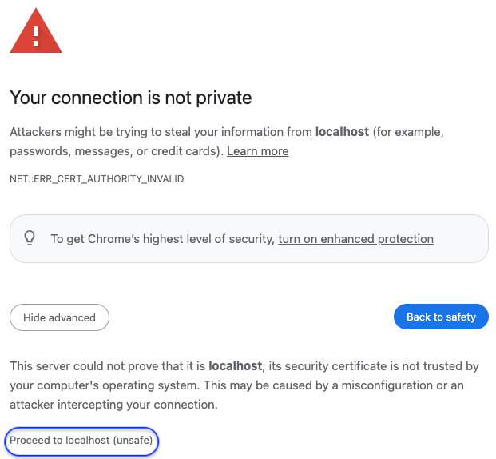

# Login as Initial Admin

## Confirm /etc/hosts
- See: [install docker-compose](../3-configure/docs/1-install#docker-compose)
- Confirm `127.0.0.1 host.docker.internal` is present in `/etc/hosts` with the following command
```
cat /etc/hosts
```

## Open Portal
- Open https://localhost:41100/portal
- A message indicating `Your connection is not private` is expected due to the self-signed certificate
- Click Advanced>Proceed to localhost (unsafe)

> 


## Login
- Login as Admin with following credentials:
  - username - `admin`
  - password - `Toor12345678`

## Change your password
- Once you login, it is recommended change your password
- On top right hover over `Account`
- Select `Change password`
- Enter New password / Click `Generate`
- Click `Update`