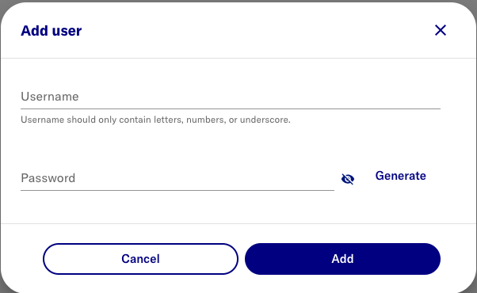
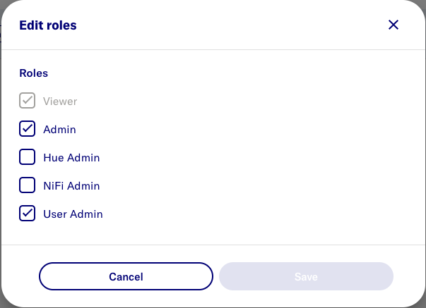
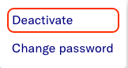

# Users & Roles

## Users
### Add Primary Admin user
- Open https://localhost:41100/portal
- Switch to **Admin Portal**
	- On top right, Click **Account** 
	- On middle left, Click **Switch to Admin portal**
- On top right, Select **Users**
- Click **Add user**

> 

### Edit roles
- On the new user row, click **Edit** and **Select** the following roles.

> 

note: 
- default role **Viewer** is sufficient for **Researcher** access

### Deactivate inital admin
- n.b. ensure another user has been granted all admin roles
- click hamburger (RHS 3-dots) for admin user
- select **Deactivate** 

> 
