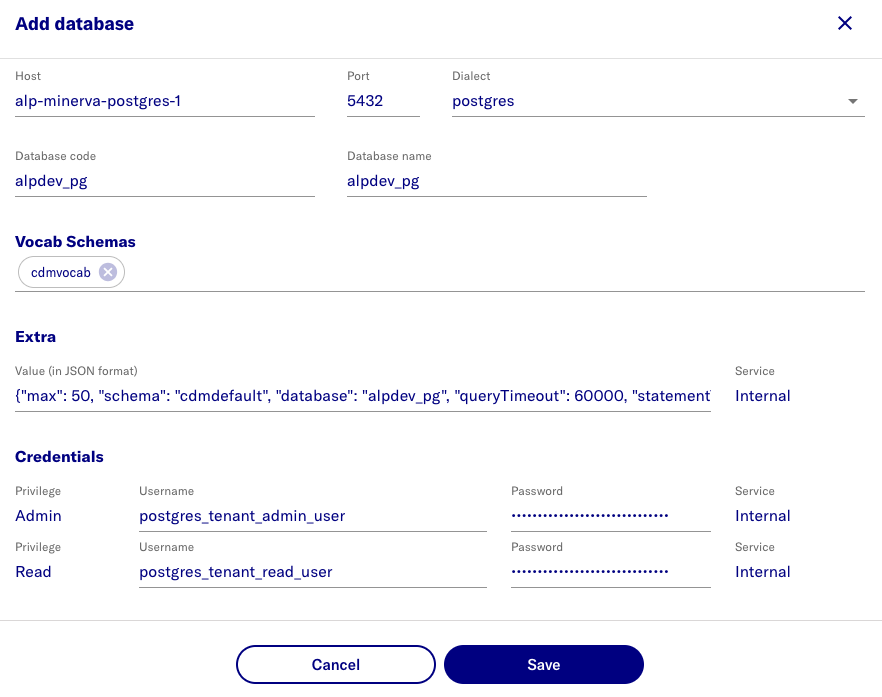

# Configure Patient Database Credentials

## Add database connection details & credentials

- Login as the new admin user
- Select **Admin** view in dropdown view on top left
- Select **Setup** on top right
  - URL is now https://localhost:41100/portal/systemadmin/setup
- Select **Databases** **Configure** button
- Select **Add database**
- Add the values from the table/image:
- Click **Save**

name | value | note
--- | --- | ---
Host | alp-minerva-postgres-1 | PostgreSQL container name /or/ external database FQDN
Database code | alpdev_pg | display name
Database name | alpdev_pg | actual name
Vocab schemas | cmdvocab | `*`
Extra | {"max": 50, "schema": "cdmdefault", "queryTimeout": 60000, "statementTimeout": 60000, "idleTimeoutMillis": 300000, "connectionTimeoutMillis": 60000, "idleInTransactionSessionTimeout": 300000}
Admin username | postgres_tenant_admin_user | `*`
Read username | postgres_tenant_read_user | `*`
Admin password | ********* | `@`
Read password | ********* | `@`

notes:
- `*` - schema/usernames are the values expected for sample data load steps - do not change 
- `@` - create a random password
- make a secure note of these secrets as they are required for the sample data load steps
  - [load-synpuf1k](5-load-synpuf1k.md)
  - [load-vocabd](6-load-vocab.md)

> 

## Restart Containers

Run the following command to restart the system for the new connection details be provisioned to the data services
```
yarn start:minerva --wait --force-recreate
```