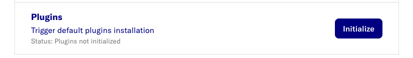

# Load Dataflow Plugins

The following plugins are currently available:

- [D2E-Plugins](https://github.com/alp-os/d2e-plugins)

## Initialize all default plugins

- Switch to `setup` page.

- Click the `initialize` button under `Plugin` .

> 

- Confirm the upload by clicking `Yes, install` at the dialog.

> 

This will initialize all the plugins available.

## Upload from individual zipfile

### Create Plugin zipfile

- If needed, clone git repositories

```bash
git clone https://github.com/alp-os/d2e-plugins
```

- Create zipfiles

```bash
cd <plugin-directory>
PLUGIN_PACKAGE_NAME="${PWD##*/}"; echo PLUGIN_PACKAGE_NAME=$PLUGIN_PACKAGE_NAME
zip -r ~/Downloads/$PLUGIN_PACKAGE_NAME.zip . -x ".git*" -x "*/.*"
```

- scripted

```bash
cd <plugin-directory>
BASE_DIR=$PWD
for PLUGIN_PACKAGE_NAME in $(find "$BASE_DIR" -mindepth 1 -maxdepth 1 -type d ! -name ".*" -exec basename {} \; | tr '\n' ' '); do
  cd $BASE_DIR/$PLUGIN_PACKAGE_NAME
  git pull
  ZIPFILE=~/Downloads/$PLUGIN_PACKAGE_NAME.zip
  if [ -e "$ZIPFILE" ]; then
    rm $ZIPFILE
  fi
  zip -q -r $ZIPFILE . -x ".git*" -x "*/.*"
done
```

### Upload Plugin zipfile

- In Portal, navigate to the **Jobs** page in the Admin portal

  > 

- Click on **Upload Job**

  > 

- Select the zipped plugin and click on **Add**
- notes:

  - Docker container shows upload logs
  - progress is not reported

- After approx 5 minutes select Jobs tab to confirm flow has uploaded successfully
  > 

## Upload from individual git url

### Public Repo

- Enter git url (e.g. https://github.com/alp-os/d2e-plugins)

- Optionally specify branch (e.g. https://github.com/alp-os/d2e-plugins@branch-name)

  > 

- Subsequent Jobs updates by simply clicking **Update deployment** button on the Jobs page.

  > 

### Private Repo

- Enter git url `https://<access_token>@github.com/<username>/<repository>.git`

- If it has subdirectories: `https://<access_token>@github.com/<username>/<repository>.git#subdirectory=<subdir>`

  > 

## Troubleshooting

- Logs are in the `alp-minerva-dataflow-mgmt` container

```bash
% yarn logs:minerva:follow alp-minerva-dataflow-mgmt
```

> yarn run v1.22.22
> $ yarn base:minerva logs -t --follow --since 1s alp-minerva-dataflow-mgmt
> $ BASE_PORT=1 docker compose --file docker-compose.yml logs -t --follow --since 1s alp-minerva-dataflow-mgmt
> [PrefectService] [32minfo[39m: Deployment Folder: prefect_python_module/kha304p37227/data_load
> [PrefectExecutionClient] [32minfo[39m: creating python virtual environment...
> [PrefectExecutionClient] [32minfo[39m: Running python...
> [PrefectExecutionClient] [32minfo[39m: Requirement already satisfied: aiobotocore==2.4.2 in /tmp/python_venv/lib/python3.10/site-packages (from -r /tmp/requirements.txt (line 1)) (2.4.2)
> ...
> [PrefectExecutionClient] [32minfo[39m: Python child process completed!
> [PrefectExecutionClient] [32minfo[39m: python virtual environment created
> [PrefectExecutionClient] [32minfo[39m: zip file to install: data-load.zip
> [PrefectExecutionClient] [32minfo[39m: Installing pip package...
> [PrefectExecutionClient] [32minfo[39m: Running python...
> [PrefectExecutionClient] [32minfo[39m: Processing ./data-load.zip
> [PrefectExecutionClient] [32minfo[39m: Preparing metadata (setup.py): started
> [PrefectExecutionClient] [32minfo[39m: Preparing metadata (setup.py): finished with status 'done'
> [PrefectExecutionClient] [32minfo[39m: Successfully installed Mako-1.3.5 MarkupSafe-3.0.1 aiobotocore-2.4.2 ...
> [PrefectExecutionClient] [32minfo[39m: Python child process completed!
> [PrefectExecutionClient] [32minfo[39m: pip install finished
> [PrefectService] [32minfo[39m: Deleted adhoc prefect deployment folder: prefect_python_module/kha304p37227/data_load
