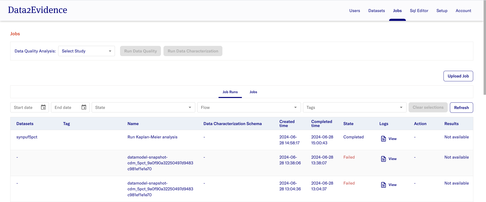
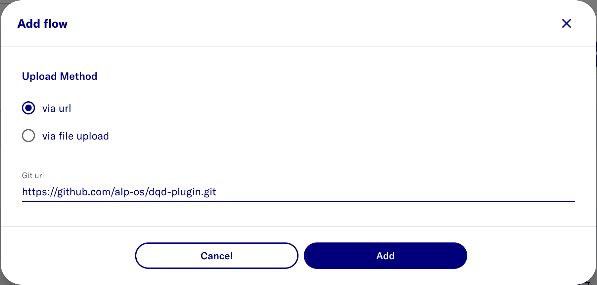

# Load Dataflow Plugins

The following plugins are currently available:
- [D2E-Plugins](https://github.com/alp-os/d2e-plugins)

## Upload from zipfile
### Create Plugin zipfile
- If needed, clone git repositories
```bash
git clone https://github.com/alp-os/d2e-plugins
```
- Create zipfiles
```bash
cd <plugin-directory>
PLUGIN_PACKAGE_NAME="${PWD##*/}"; echo PLUGIN_PACKAGE_NAME=$PLUGIN_PACKAGE_NAME
zip -r ~/Downloads/$PLUGIN_PACKAGE_NAME.zip . -x ".git*" -x "*/.*"
```
- scripted
```bash
BASE_DIR=$PWD
for PLUGIN_PACKAGE_NAME in dqd-plugin datamodel-plugin; do 
  cd $BASE_DIR/$PLUGIN_PACKAGE_NAME
  git pull
  ZIPFILE=~/Downloads/$PLUGIN_PACKAGE_NAME.zip
  rm $ZIPFILE
  zip -q -r $ZIPFILE . -x ".git*" -x "*/.*"
  ls -lh $ZIPFILE
done
cd $BASE_DIR
```
### Upload Plugin zipfile
- In Portal, navigate to the **Jobs** page in the Admin portal
> 

- Click on **Upload Job**
> 

- Select the zipped plugin and click on **Add**
- notes: 
  - Docker container shows upload logs
  - progress is not reported

- After approx 5 minutes select Jobs tab to confirm flow has uploaded successfully
> 

## Upload from git url
- **n.b.: git repository must be public accessible**
- Enter git url (e.g. https://github.com/alp-os/d2e-plugins)

- Optionally specify branch (e.g. https://github.com/alp-os/d2e-plugins@branch-name)
> 

- Subsequent Jobs updates by simply clicking **Update deployment** button on the Jobs page.
> 

- If repo is private
- Enter git url `https://<access_token>@github.com/<username>/<repository>.git`
- If it has subdirectories: `https://<access_token>@github.com/<username>/<repository>.git#subdirectory=<subdir>`