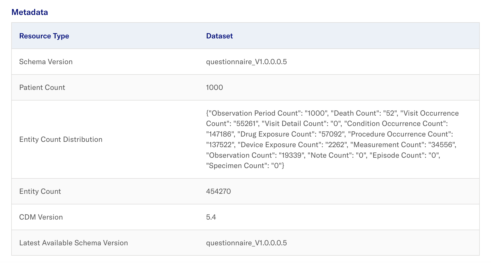

# Data Load

## Creating Datasets
- In the Admin Portal, navigate to **Datasets** > **Add dataset**
  >**The expected display is:**

- Provide the dataset [parameters](../3-configure/1-create-dataset.md) accordingly.
  > **The expected result upon successful addition of dataset**: 

## Dataset Permissions
The Admin Portal allows the admin to perform dataset management to provide users with permissions for selected datasets. 
- In the Admin Portal, navigate to **Datasets**. 
- Navigate to the dataset you wish to provide/revoke permission access for users. 
- Under **Actions** dropdown, select **Permissions** to view users who have requested for access or provide access to existing users. 
- Refer to the [documentation here](../3-configure/2-dataset-permissions.md) for a detailed guide on setting permissions.

## Platform Configuration

### Generating Data Quality Dashboard (DQD)
This section generates the Data Quality Dashboard based on the dataset of interest. 
- In the Admin Portal, navigate to **Datasets**. Navigate to the dataset of interest and click **Select Action**. 
- Select **Run data quality** and select the **Run Analysis** button. 
- Repeat the step for **Run data characterization**.
- After completing the **Data Quality** and **Data Characterization** job runs,  section, refer to the [documentation here](../3-configure/4-dqd-dashboard.md) to access the Data Quality Dashboard for the respective datasets in the Researcher portal.

  > **The expected result is:** 

### Create Cache
This section provides the steps for setting up the analytics environment.
- Navigate to the dataset of interest and click **Select Action**. 
- Select **Create cache**.
- Refer to the [documentation here](../3-configure/5-create-duckdb-file.md) to create cache via the Jobs Portal.

### Update Datasets Metadata 
- In the Admin Portal, navigate to **Datasets** tab and select **Update dataset metadata**. 
- Refer to the [documentation here](../3-configure/7-fetch-datasets-metadata.md) for more details.

**The expected result is as follows:**
>
>
