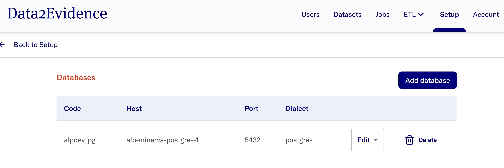

# Data Load

## Adding Existing Databases

This sections assumes that there is an existing database available. The database should be in a Postgres docker container name or external database with a Fully Qualified Domain Name (FQDN).

- In the Admin Portal, navigate to **Setup** > **Databases** > **Configure** > **Add database**
  > **The expected display is:** 
- Select **Add database** and provide the database information accordingly.
- Please refer to [documentation here](../2-load/4-setup-db-credentials.md) for more details on the input parameters for database creation.
  > **The expected result after adding a database is:** 
- Perform a restart of the system for new connection details to be provisioned to the data services using the command:

```bash
d2e start; sleep 60
```

If there is no existing databases available, you may consider using the following sample database below and continue with the guide from section [Plugins](#plugins) onwards.

- [Synthetic Public Use Files (SynPUFs)](../2-load/): Perform sub-steps [3](../2-load/3-setup-pg-permissions.md), [4](../2-load/4-setup-db-credentials.md), [6](../2-load/6-load-synpuf1k.md) and [7](../2-load/7-load-vocab.md)
- broadsea-atlasdb: Refer to the docs [here](../2-load/8-load-broadsea.md)

## Plugins

The Admin portal allows the admin user to manage plugins in the platform, for instance installation, version updates and uninstallation of plugins.

- In the Admin Portal, navigate to **Setup** > **Plugins** > **Configure**
  > **The expected display is:**

## Jobs Portal

The Admin portal allows the admin user to perform customized and scheduled job runs from [plugins](#plugins) that have been installed.

- In the Admin Portal, navigate to **Jobs** and select the **Jobs** tab.

  > **The expected display is**: 

- Select the `⋮` icon to perform the respective job functions.
- Select **Job Runs** tab to get the job run status.

## Creating Datasets

- In the Admin Portal, navigate to **Datasets** > **Add dataset**

  > **The expected display is:**

- Provide the dataset [parameters](../3-configure/1-create-dataset.md) accordingly.
  > **The expected result upon successful addition of dataset**: 

## Dataset Permissions

The Admin Portal allows the admin to perform dataset management to provide users with permissions for selected datasets.

- In the Admin Portal, navigate to **Datasets**.
- Navigate to the dataset you wish to provide/revoke permission access for users.
- Under **Actions** dropdown, select **Permissions** to view users who have requested for access or provide access to existing users.
- Refer to the [documentation here](../3-configure/2-dataset-permissions.md) for a detailed guide on setting permissions.

## Platform Configuration

### Generating Data Quality Dashboard (DQD)

This section generates the Data Quality Dashboard based on the dataset of interest.

- In the Admin Portal, navigate to **Datasets**. Navigate to the dataset of interest and click **Select Action**.
- Select **Run data quality** and select the **Run Analysis** button.
- Repeat the step for **Run data characterization**.
- After completing the **Data Quality** and **Data Characterization** job runs, section, refer to the [documentation here](../3-configure/4-dqd-dashboard.md) to access the Data Quality Dashboard for the respective datasets in the Researcher portal.

  > **The expected result is:** 

### Create Cache

This section provides the steps for setting up the analytics environment.

- Navigate to the dataset of interest and click **Select Action**.
- Select **Create cache**.
- Refer to the [documentation here](../3-configure/5-create-duckdb-file.md) to create cache via the Jobs Portal.

### Update Datasets Metadata

- In the Admin Portal, navigate to **Datasets** tab and select **Update dataset metadata**.
- Refer to the [documentation here](../3-configure/7-fetch-datasets-metadata.md) for more details.

**The expected result is as follows:**

>  >
