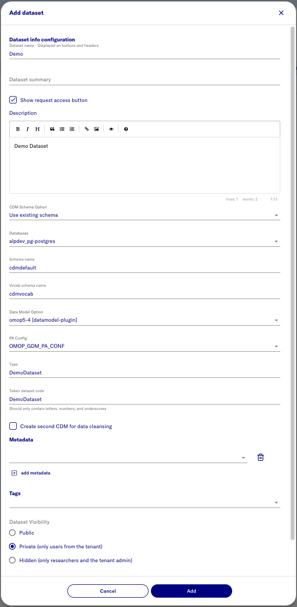
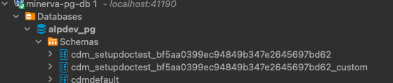

# Create a dataset 
- open https://localhost:41100/portal
- Login as primary admin as
- Select **Admin** mode
- Navigate to **Datasets**
- Select **Add dataset**

name | value | note
--- | --- | ---
Dataset name | eg. Demo
CDM Schema Option | Use existing schema
Schema Name field | e.g. cdmdefault | name of the cdm schema that was used for seeding
Vocab schema name | e.g. cdmvocab
Data Model Option | omop5-4 [datamodel-plugin]
PA Config | OMOP_GDM_PA_CONF
Type | e.g. DemoDataset
Token dataset code | e.g. DemoDataset

> 

- Expected result as follows

> 

- Expected result as follows

> 