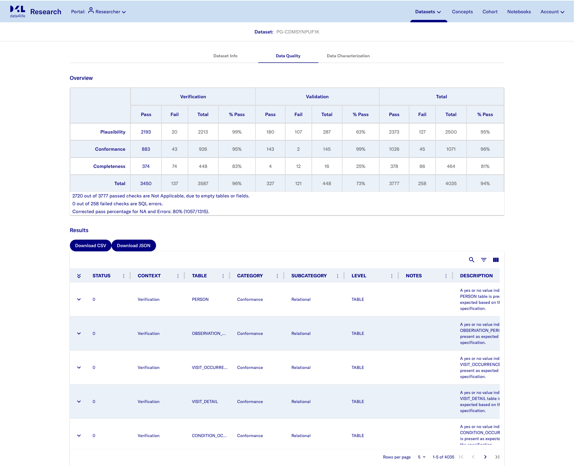

## Data Quality Dashboard
- Open https://localhost:41100/portal/researcher
- Select a **Dataset** either by keying in the `Search Datasets` field or scrolling down below
- Select a Dataset e.g. Demo
- Select Data Quality tab

> 
>
> dashboard