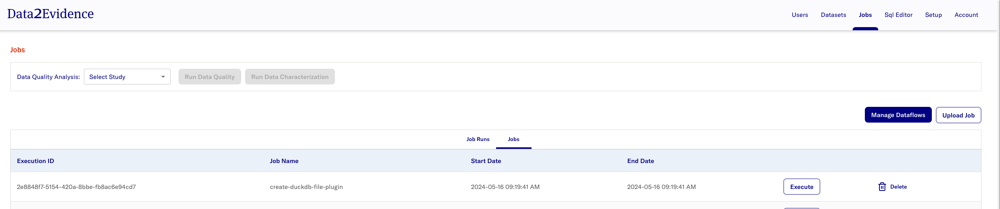
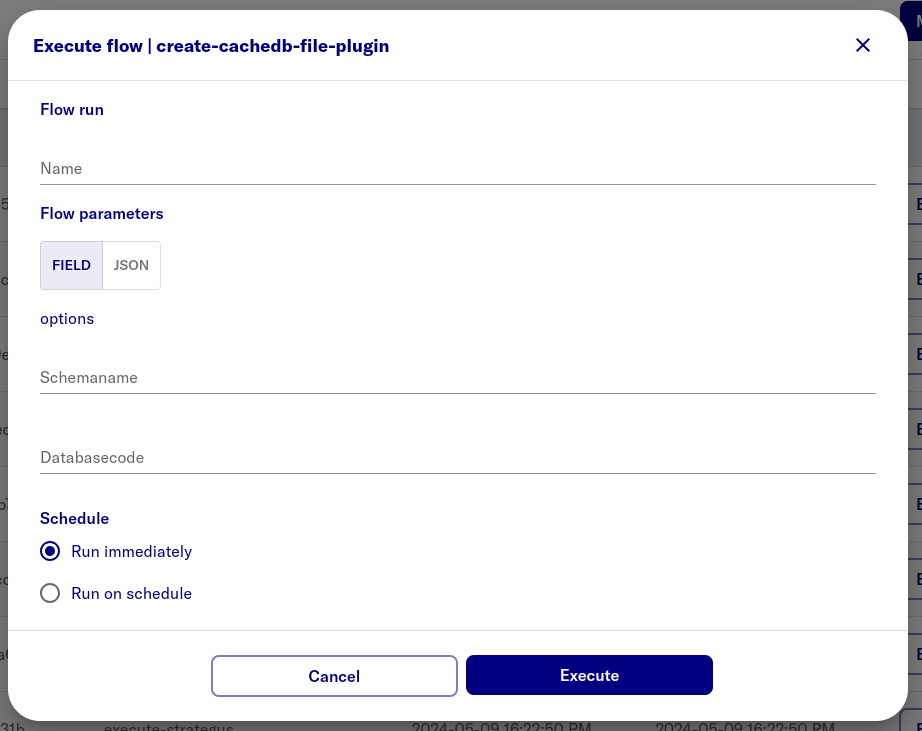

# Create duckdb database file

After uploading duckdb-plugin in step `docs/2-load/5-load-d2e-plugins.md`

- [D2E-Plugins/duckdb](https://github.com/alp-os/d2e-plugins/tree/main/duckdb)

<h1 id="gui">Creating via portal</h1>

- open https://localhost:41100/portal
- Login as primary admin as
- Select **Admin** mode
- Navigate to **Jobs**
- Click **Execute** on **create-duckdb-file-plugin**
  

- Enter values to create duckdb database file for cdmdefault
  name | value | note
  --- | --- | ---
  Flow run | eg. duckdb file for cdmdefault | Arbritrary name for flow run
  Flow parameters | { "schemaName": "cdmdefault", "databaseCode": "alpdev_pg" } | Create duckdb database file for cdmdefault schema

  Example:
  

### Repeat steps above with input a different input for **Flow parameters** to create a duckdb database file for cdmvocab

| name            | value                                                     | note                                            |
| --------------- | --------------------------------------------------------- | ----------------------------------------------- |
| Flow run        |                                                           | Arbritrary name for flow run                    |
| Flow parameters | { "schemaName": "cdmvocab", "databaseCode": "alpdev_pg" } | Create duckdb database file for cdmvocab schema |
