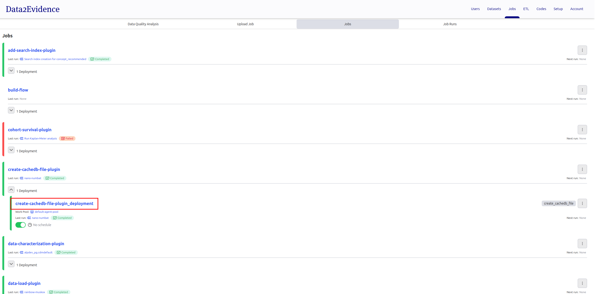

# Create duckdb database file

After uploading cachedb-plugin in step `docs/2-load/5-load-d2e-plugins.md`

- [D2E-Plugins/duckdb](https://github.com/data2evidence/d2e-flows/tree/main/flows/create_cachedb_file_plugin)

<h1 id="gui">Creating via portal</h1>

- open https://localhost:41100/portal
- Login as primary admin as
- Select **Admin** mode
- Navigate to **Jobs**
  
- Click on **Jobs** tab.
  
- Click **create-cachedb-file-plugin_deployment**
  
- Click **Run** and then **Quick Run**
  

- Click on **JSON** tab and enter values to create a duckdb database file for cdmdefault
  name | value | note
  --- | --- | ---
  Flow parameters | { "options": { "schemaName": "cdmdefault", "databaseCode": "alpdev_pg" } } | Create duckdb database file for cdmdefault schema with alpdev_pg database code

  Example:

  

### Repeat steps above with input a different input for **Flow parameters** to create a duckdb database file for cdmvocab

| name            | value                                                                    | note                                                                         |
| --------------- | ------------------------------------------------------------------------ | ---------------------------------------------------------------------------- |
| Flow parameters | { "options": { "schemaName": "cdmvocab", "databaseCode": "alpdev_pg" } } | Create duckdb database file for cdmvocab schema with alpdev_pg database code |
