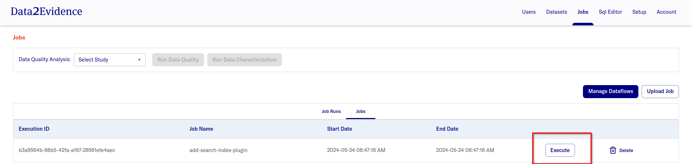
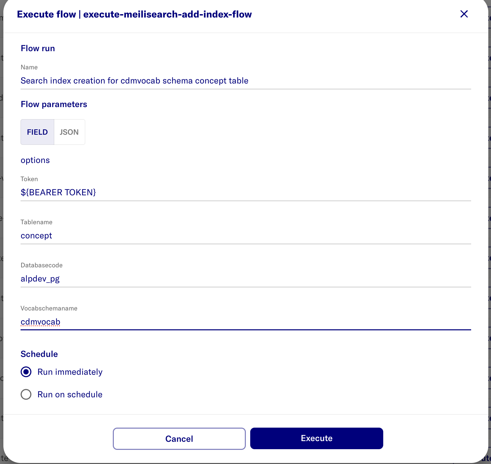

# Create meilisearch indexes

D2E requires the following tables from the OMOP concept schema to have meilisearch indexes created for concept set functionality to work

- concept
- concept_relationship
- relationship
- vocabulary
- concept_synonym
- concept_class
- domain
- concept_ancestor
- concept_recommended

Follow the steps below to create search indexes for the following tables mentioned above

After uploading meilisearch-plugin in step `docs/2-load/5-load-d2e-plugins.md`

- [D2E-Plugins/meilisearch](https://github.com/alp-os/d2e-plugins/tree/main/meilisearch)

<h1 id="gui">Creating via portal</h1>
 
  - open https://localhost:41100/portal
  - Login as primary admin as
  - Select **Admin** mode
  - Navigate to **Jobs**
  - Click **Execute** on **add-search-index-plugin**
  

- Enter values to create search index for concept table in cdmvocab schema
  name | value | note
  --- | --- | ---
  Flow run | eg. search index creation for cdmvocab.concept | Arbritrary name for flow run
  Flow parameters | { "tableName": "concept", "databaseCode": "alpdev_pg", "vocabSchemaName": "cdmvocab" } | Create search index for concept table in cdmvocab schema

  Example:
  

### Repeat steps above with input the following inputs for **Flow parameters** to create a search indexes for

1. Create search index for concept_relationship table in cdmvocab schema

| name            | value                                                                                               | note                                                                  |
| --------------- | --------------------------------------------------------------------------------------------------- | --------------------------------------------------------------------- |
| Flow run        |                                                                                                     | Arbritrary name for flow run                                          |
| Flow parameters | { "tableName": "concept_relationship", "databaseCode": "alpdev_pg", "vocabSchemaName": "cdmvocab" } | Create search index for concept_relationship table in cdmvocab schema |

2. Create search index for relationship table in cdmvocab schema

| name            | value                                                                                       | note                                                          |
| --------------- | ------------------------------------------------------------------------------------------- | ------------------------------------------------------------- |
| Flow run        |                                                                                             | Arbritrary name for flow run                                  |
| Flow parameters | { "tableName": "relationship", "databaseCode": "alpdev_pg", "vocabSchemaName": "cdmvocab" } | Create search index for relationship table in cdmvocab schema |

3. Create search index for vocabulary table in cdmvocab schema

| name            | value                                                                                     | note                                                        |
| --------------- | ----------------------------------------------------------------------------------------- | ----------------------------------------------------------- |
| Flow run        |                                                                                           | Arbritrary name for flow run                                |
| Flow parameters | { "tableName": "vocabulary", "databaseCode": "alpdev_pg", "vocabSchemaName": "cdmvocab" } | Create search index for vocabulary table in cdmvocab schema |

4. Create search index for concept_synonym table in cdmvocab schema

| name            | value                                                                                          | note                                                             |
| --------------- | ---------------------------------------------------------------------------------------------- | ---------------------------------------------------------------- |
| Flow run        |                                                                                                | Arbritrary name for flow run                                     |
| Flow parameters | { "tableName": "concept_synonym", "databaseCode": "alpdev_pg", "vocabSchemaName": "cdmvocab" } | Create search index for concept_synonym table in cdmvocab schema |

5. Create search index for concept_class table in cdmvocab schema

| name            | value                                                                                        | note                                                           |
| --------------- | -------------------------------------------------------------------------------------------- | -------------------------------------------------------------- |
| Flow run        |                                                                                              | Arbritrary name for flow run                                   |
| Flow parameters | { "tableName": "concept_class", "databaseCode": "alpdev_pg", "vocabSchemaName": "cdmvocab" } | Create search index for concept_class table in cdmvocab schema |

6. Create search index for domain table in cdmvocab schema

| name            | value                                                                                 | note                                                    |
| --------------- | ------------------------------------------------------------------------------------- | ------------------------------------------------------- |
| Flow run        |                                                                                       | Arbritrary name for flow run                            |
| Flow parameters | { "tableName": "domain", "databaseCode": "alpdev_pg", "vocabSchemaName": "cdmvocab" } | Create search index for domain table in cdmvocab schema |

7. Create search index for concept_ancestor table in cdmvocab schema

| name            | value                                                                                           | note                                                              |
| --------------- | ----------------------------------------------------------------------------------------------- | ----------------------------------------------------------------- |
| Flow run        |                                                                                                 | Arbritrary name for flow run                                      |
| Flow parameters | { "tableName": "concept_ancestor", "databaseCode": "alpdev_pg", "vocabSchemaName": "cdmvocab" } | Create search index for concept_ancestor table in cdmvocab schema |

8. Create search index for concept_recommended table in cdmvocab schema

| name            | value                                                                                              | note                                                                 |
| --------------- | -------------------------------------------------------------------------------------------------- | -------------------------------------------------------------------- |
| Flow run        |                                                                                                    | Arbritrary name for flow run                                         |
| Flow parameters | { "tableName": "concept_recommended", "databaseCode": "alpdev_pg", "vocabSchemaName": "cdmvocab" } | Create search index for concept_recommended table in cdmvocab schema |
