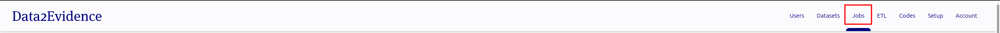
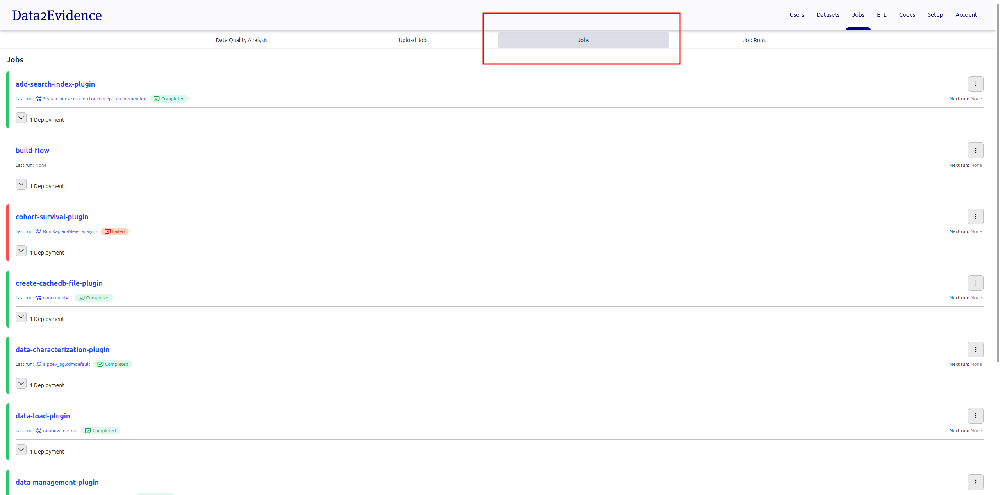
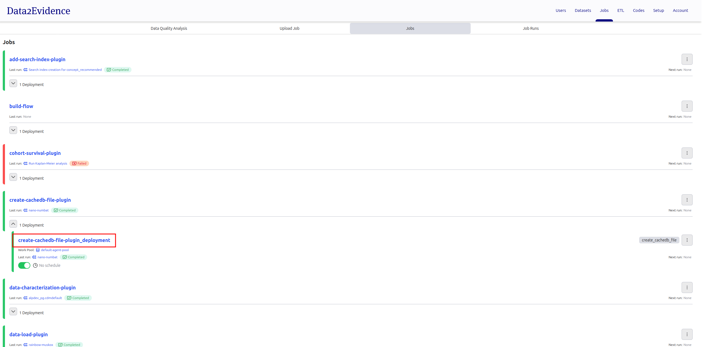
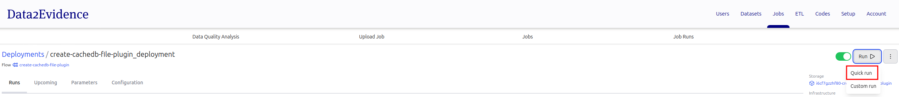
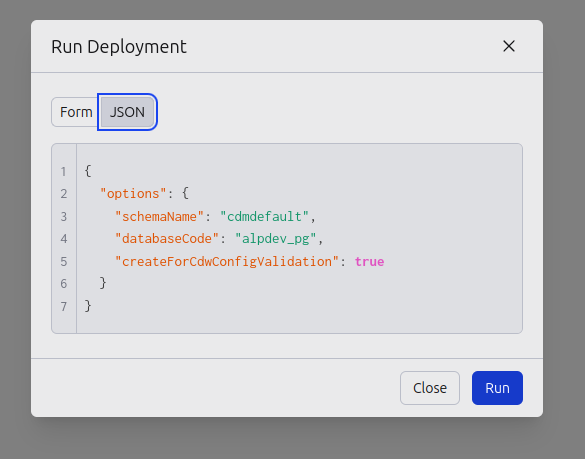

# Create cdw config duckdb database file used for validation (Optional)

For alp-minerva-cdw-svc, it uses a duckdb database file for validation purposes. This file comes with the source code at `services/cdw-svc/src/duckdb/cdw_config_svc_validation_schema`.

However, in the case of further updates to any data models, an updated validation duckdb database file is required. In order to create this updated validation duckdb database file, run the following steps.

After uploading cachedb-plugin in step `docs/2-load/5-load-d2e-plugins.md`

- [D2E-Plugins/duckdb](https://github.com/data2evidence/d2e-flows/tree/main/flows/create_cachedb_file_plugin)

<h1 id="gui">Creating via portal</h1>

- open https://localhost:41100/portal
- Login as primary admin as
- Select **Admin** mode
- Navigate to **Jobs**
  
- Click on **Jobs** tab.
  
- Click **create-cachedb-file-plugin_deployment**
  
- Click **Run** and then **Quick Run**
  

- Click on **JSON** tab and enter values to create a cdw-config validation duckdb database file for cdmdefault
  name | value | note
  --- | --- | ---
  Flow parameters | { "options": { "schemaName": "cdmdefault", "databaseCode": "alpdev_pg", "createForCdwConfigValidation": true } } | Create cdw-config validation duckdb database file for cdmdefault schema

  Example:

  
