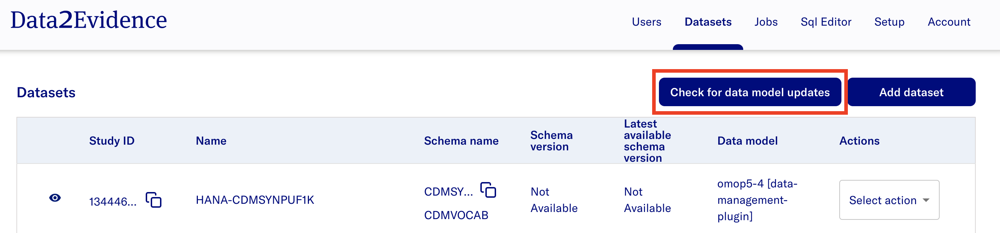
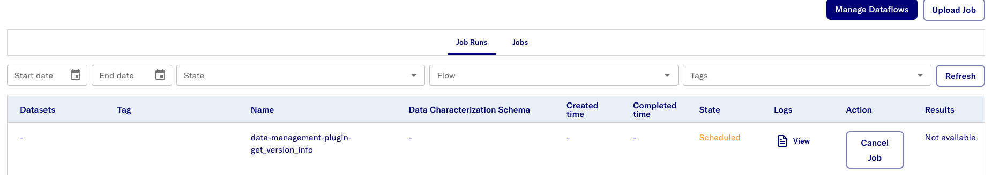
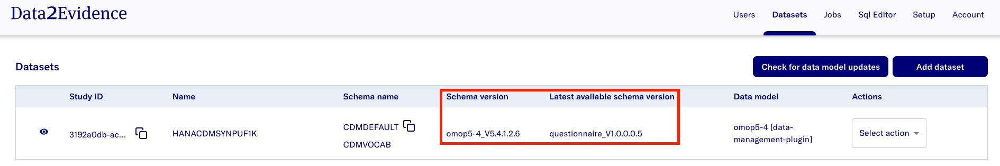

# Fetch metadata for datasets

To fetch metadata for datasets, click the `Check for data model updates` button in the `Datasets` tab

This should trigger a job to run in the background which will update the following metadata:
- Current Schema Version
- Latest Available Schema Version
- CDM Version (OMOP data models only)
- Patient Count (OMOP data models only)
- Entity Count Distribution (OMOP data models only)
- Total Entity Count (OMOP data models only)

Current Schema Version and Latest Available Schema Version are displayed on the datasets page

For OMOP data models:
- The dataset will be displayed in the Researcher portal alongside an updated donut chart if data is present in the schema
- The donut chart is populated based on the Entity Count Distribution
- Total Subjects is based on the Patient Count
- This information can also be viewed in the Dataset Info tab

