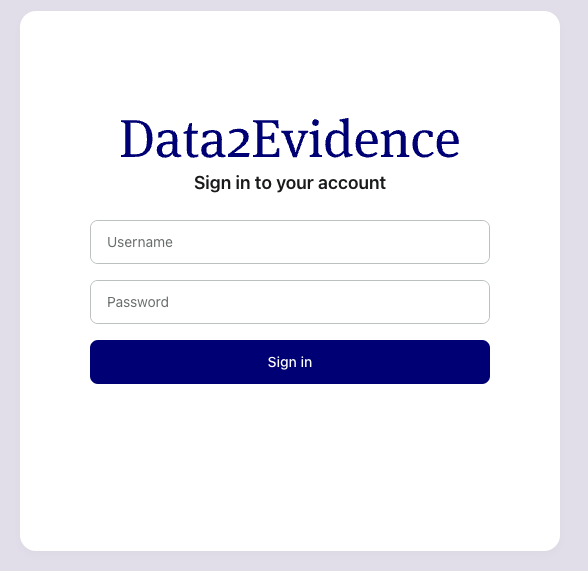
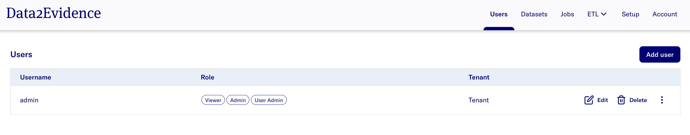
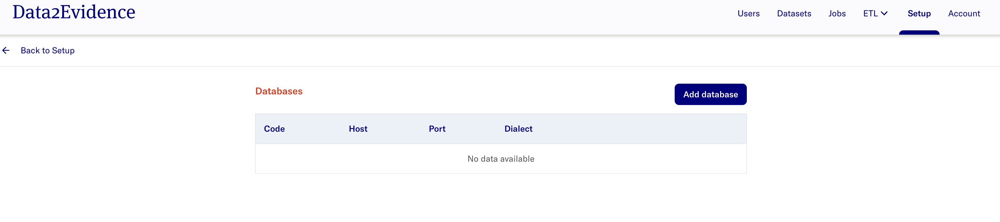
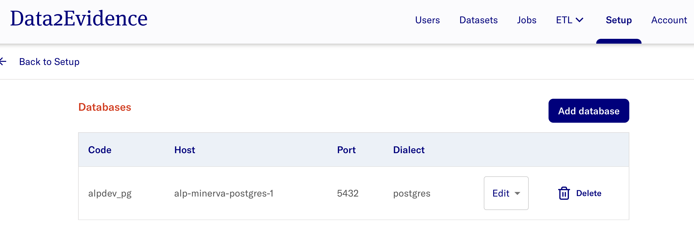
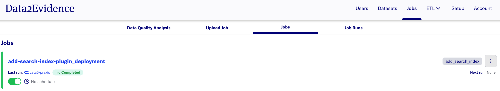
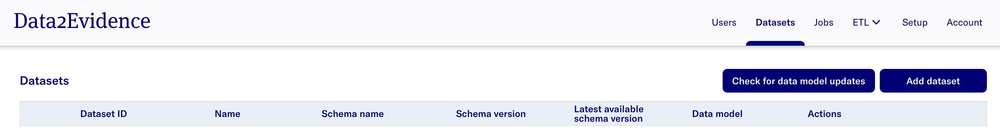
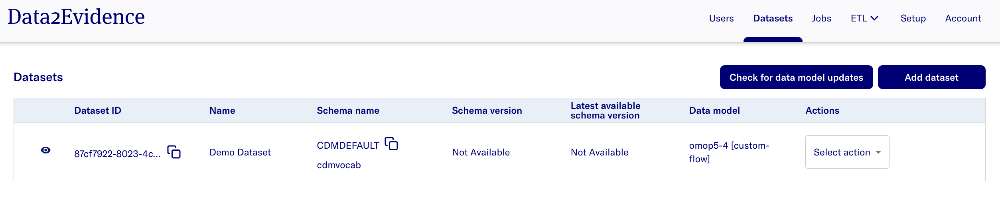
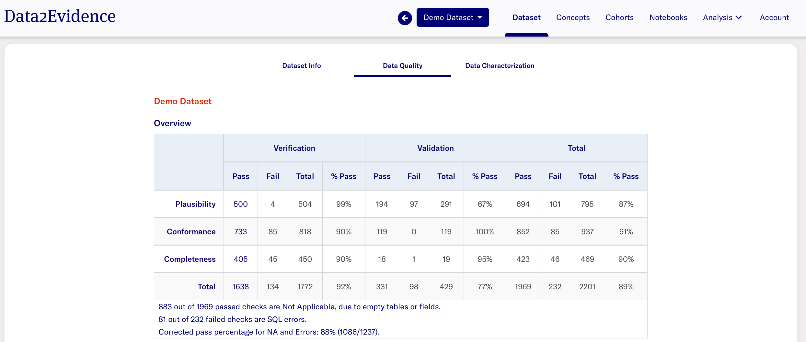
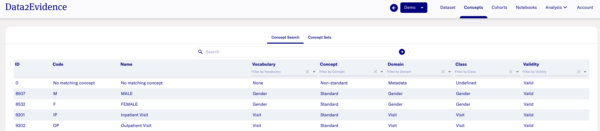

# D2E Documentation (trex)
The following documentation outlines the basic setup of D2E for users who require the software.

1. Install pre-requisite softwares for running D2E. Refer to the installation guide [here](./1-setup/README.md). 

2. Clone Github repository d2e in your terminal using the command: `git clone --branch <branch-name> https://github.com/alp-os/d2e.git`. 
    - Note: Edit `<branch-name>` to `develop`

**Setting Up Credentials** 

1. Generating credentials: ```yarn gen:dotenv```

2. Setting up variable `DB_CREDENTIALS__INTERNAL__DECRYPT_PRIVATE_KEY` for `env.local`
    - Use the command `openssl rsa -in encrypted_private.key -out decrypted_private.key` and variables below for the setup.

      Variables           | Command                                                                                                                                                                     |
      ---                 | ---                                                                                                                                                                         |
      DB_CREDENTIALS__INTERNAL__PUBLIC_KEY              | to be created as `encrypted_private.key`                                                                                                   |
      DB_CREDENTIALS__INTERNAL__PRIVATE_KEY_PASSPHRASE  | to be used when prompted                                                                                                                   |
      DB_CREDENTIALS__INTERNAL__DECRYPT_PRIVATE_KEY     | Output generated in `decrypted_private.key`. Add output to `.env.local` in the form: `DB_CREDENTIALS__INTERNAL__DECRYPT_PRIVATE_KEY=<to-be-replaced>`     |
      _(for more info, refer [here](https://marco.maranao.ca/articles/how-decrypt-rsa-private-key-using-openssl#google_vignette))_

3. Please ensure Github PAT token has been created. Add the token in the `env.local` file with the format `GH_TOKEN=<to-be-replaced>`.
      
4. Initialize Authentication Applications: ```yarn init:logto```
    - For more info on the credentials generated, please refer to the [documentation here](./docs/1-setup/environment-variables.md)

**Setting Up Application**

5. Request credentials from [D2E Support](#d2e-support) for authenticating to private docker registry to retrieve resources to run D2E.
6. Run the command `yarn build:minerva` to get the neccessary docker images to run D2E. 
7. Starting Application User Interface (UI): ```yarn start:ui --wait```
8. Start/Restarting application: ```yarn local:minerva up```

> **Note:**
>
> Pointers 1 - 4 are required if you are starting the application for first time and if docker volume resources have been completely removed. 
>
> If you have setup the application before, only pointers 7 & 8 is required.


# D2E Guide 
## Authentication Portal
- Input the URL https://localhost:41100/portal into a Chrome web browser. A ["**Proceed to localhost**"](images/chrome/chrome-proceed-to-localhost.png) display is expected.
- Select **Advanced** > **Proceed to localhost (unsafe)**

> **The expected display is:** 
>
> 

## Accessing Admin Portal
The Admin Portal allows authorized personnel to login and perform user, datasets and job plugin management. 

- Login as Admin with following credentials:
  - username - `admin`
  - password - `Updatepassword12345`

- Click on Account > Switch to admin portal 

> **The expected display is:**
> 

- For quick access to the Admin Portal, input the URL https://localhost:41100/portal/systemadmin/user-overview. 
- Refer to the [documentation here](./2-load/2-users-roles.md) for performing user management. 


## Adding Existing Databases

This sections assumes that there is an existing database available. The database should be in a Postgres docker container name or external database with a Fully Qualified Domain Name (FQDN).

If there is no existing databases available, users may consider using a sample dataset with the detailed [documentation here](./2-load/), and perform steps 3 to 7 to setup a sample database. Thereafter, users may continue to follow the guide below.


- In the [Admin Portal](#accessing-admin-portal), navigate to **Setup** > **Databases** > **Configure** > **Add database**
  > **The expected display is:** 
- Select **Add database** and provide the database information accordingly. 
- Please refer to [documentation here](./2-load/4-setup-db-credentials.md) for more details on the input parameters for database creation.
  >**The expected result after adding a database is:** 


## Upload Jobs
Please ensure that job plugins have been downloaded as zip files. 

- In the [Admin Portal](#accessing-admin-portal), navigate to **Jobs** > **Upload Job**
 

- To ensure that the jobs have been successfully uploaded, select the **Jobs** tab.
> **The expected display is**: 

- Refer to the [documentation here](./2-load/5-load-d2e-plugins.md) to upload jobs via other means (internet connection might be required).
- Navigate to **Setup** > **Trex plugins** > **Configure** to update or install new plugins.


## Creating Datasets
- In the [Admin Portal](#accessing-admin-portal), navigate to **Datasets** > **Add dataset**
  >**The expected display is:**

  
- Provide the dataset information accordingly. Refer to the [documentation here](./3-configure/1-create-dataset.md) for more details on the dataset parameters.
  > **The expected result if dataset has been successfully added**: 

## Dataset Permissions
The [Admin Portal](#accessing-admin-portal) allows users to perform dataset management to provide users with permissions for selected datasets. 
- Input the url https://localhost:41100/portal/systemadmin/dataset-overview. 
- Navigate to the dataset you wish to provide/revoke permission access for users. 
- Under **Actions** dropdown, select **Permissions** to view users who have requested for access or provide access to existing users. 
- Refer to the [documentation here](./3-configure/2-dataset-permissions.md) for a detailed guide on setting permissions.


## Running Jobs

### Running Data Quality and Characterization Job
- In the [Admin Portal](#accessing-admin-portal), navigate to **Jobs** > **Data Quality Analysis** tab.
- Select the respective job to run.
- Refer to the [documentation here](./3-configure/3-dqd-job.md) for a more detailed guide on running Data Quality and Characterization jobs.

#### Data Quality Dashboard
- After completing **Data Quality** and **Data Characterization** job runs in the [**Running Data Quality and Characterization Job**](#running-data-quality-and-characterization-job) section, refer to the [documentation here](./3-configure/4-dqd-dashboard.md) to access the Data Quality Dashboard for the respective datasets in the Researcher portal.

  > **The expected result is:** 

### Running Duckdb Job
This section provides the steps for setting up the analytics environment.
- Please ensure that `create-cachedb-file-plugin_deployment` job has been uploaded. 
- Refer to the [documentation here](./3-configure/5-create-duckdb-file.md) for a detailed guide on creating a duckdb file.

### Run Job for Creating Search Indexes for Schema Concept Table
This section provides the steps for setting up the schema concept table. 

- In the [Admin Portal](#accessing-admin-portal), navigate to **Jobs** and perform a **Quick Run** on `add-search-index-plugin_deployment`
- Refer to the [documentation here](./3-configure/6-create-meilisearch-indexes.md) on the details to create the indexes search.

- Input the URL https://localhost:41100/portal/researcher. Navigate to **Concepts**. 
  > **The expected result is:** 

## Fetching Datasets Metadata 
- In the Admin Portal, navigate to **Datasets** tab and select **Check for data model updates**. 
- Refer to the [documentation here](./3-configure/7-fetch-datasets-metadata.md) for more details.

**The expected result is as follows:**
>
>

## Cohort Creation
- Navigate to [Researcher Portal](https://localhost:41100/portal/researcher) and select **Cohort** tab.
- Refer to the [documentation here](./3-configure/8-cohort.md) for more details.

## Stopping Application
1. Stop all containers: `yarn stop:minerva`
2. Perform clean-up: `yarn clean:minerva`
    - **WARNING**: removes all containers and volumes


# D2E Support