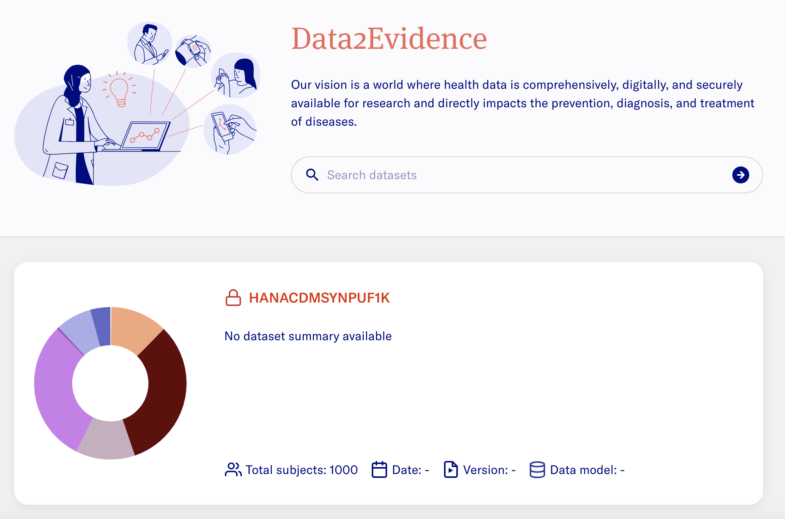

# Analytics Platform Documentation (D2E)

 &nbsp;&nbsp;  &nbsp;&nbsp; 

The following documentation outlines the basic setup of Analytics Platform (D2E) for users who require the software.

# Getting Started 
## Pre-requisites
1. Install pre-requisite softwares for running D2E. Refer to the installation guide [here](./1-setup/README.md). 
2. Clone Github repository d2e in your terminal using the command: `git clone --branch develop https://github.com/alp-os/d2e.git`. 
3. Clone Github repository d2e-plugins in your terminal using the command: `git clone --branch trex https://github.com/alp-os/d2e-plugins.git`. _(TODO - this step will be updated)_
4. Request docker credentials from [D2E Support](#d2e-support) for authenticating to private docker registry to retrieve resources to run D2E.

## Environment Variables and Credentials Setup 
5. Generate environment variables: `yarn gen:dotenv`
   - Refer [here](./1-setup/environment-variables.md) for more information on the environment variables generated.
6. Append the following variables to the `env.local` file in the format:
   - `GH_TOKEN=<your-Github-PAT-token>`. (Refer [here](./1-setup/README.md) for more info)
   - `DATABASE_CREDENTIALS=[]` 
7. Initialize Authentication Applications: `yarn init:logto`

## Application Setup

In d2e-plugins repo, _(TODO - this step will be updated)_

8. Run the command to build the neccessary docker images to run D2E plugins: `yarn build`. 

In d2e repo, 

9. Run the command to get the neccessary docker images to run D2E: `yarn build:minerva`
10. Starting Application User Interface (UI): `yarn start:ui --wait`
11. Start/Restarting application: `yarn start:minerva --wait; sleep 60`

> **Note:**
> - If you are starting the application for first time and/or if docker volume resources have been completely removed, re-run the **Environment Variables and Credentials Setup** section
> - If you have setup the application before, run steps in section **Application Setup** as required.

# D2E Guide 
## Authentication Portal
- Input the URL https://localhost:41100/portal into a Chrome web browser. A ["**Proceed to localhost**"](images/chrome/chrome-proceed-to-localhost.png) display is expected.
- Select **Advanced** > **Proceed to localhost (unsafe)**

> **The expected display is:** 
>
> 

## Accessing Admin Portal
The Admin Portal allows authorized personnel to login and perform the management of users, datasets and job plugins. 

- Login as Admin with following credentials:
  - username - `admin`
  - password - `Updatepassword12345`

- Click on **Account** on the top right > **Switch to admin portal**

> **The expected display is:**
> 

- For quick access to the Admin Portal, input URL https://localhost:41100/portal/systemadmin/user-overview in the search bar.
- Refer to the [documentation here](./2-load/2-users-roles.md) to perform user management. 

## Adding Existing Databases

This sections assumes that there is an existing database available. The database should be in a Postgres docker container name or external database with a Fully Qualified Domain Name (FQDN).

If there is no existing databases available, you may consider using a [sample dataset](./2-load/), and perform sub-steps 3 to 7 to setup the database. Thereafter, you may continue to follow the guide from section [Plugins](#plugins) onwards.

- In the Admin Portal, navigate to **Setup** > **Databases** > **Configure** > **Add database**
  > **The expected display is:** 
- Select **Add database** and provide the database information accordingly. 
- Please refer to [documentation here](./2-load/4-setup-db-credentials.md) for more details on the input parameters for database creation.
  >**The expected result after adding a database is:** 
- Perform a restart of the system for new connection details to be provisioned to the data services using the command: `yarn start:minerva --wait --force-recreate`

## Plugins 
The Admin portal allows the admin user to manage plugins in the platform, for instance installation, update and uninstallation of plugins. 
- In the Admin Portal, navigate to **Setup** > **Trex Plugins** > **Configure**
  >**The expected display is:**

- Refer to the [documentation here](./2-load/5-load-d2e-plugins.md) for more information on plugins.

## Jobs Portal
The Admin portal allows the admin user to perform customized and scheduled job runs from [plugins](#plugins) that have been installed.

- In the Admin Portal, navigate to **Jobs** and select the **Jobs** tab.
> **The expected display is**: 

- Select the `⋮` icon to perform the respective job functions. 
- Select **Job Runs** tab to get the job run status.

## Creating Datasets
- In the Admin Portal, navigate to **Datasets** > **Add dataset**
  >**The expected display is:**

  
- Provide the dataset [parameters](./3-configure/1-create-dataset.md) accordingly.
  > **The expected result upon successful addition of dataset**: 

## Dataset Permissions
The Admin Portal allows the admin to perform dataset management to provide users with permissions for selected datasets. 
- Input the url https://localhost:41100/portal/systemadmin/dataset-overview. 
- Navigate to the dataset you wish to provide/revoke permission access for users. 
- Under **Actions** dropdown, select **Permissions** to view users who have requested for access or provide access to existing users. 
- Refer to the [documentation here](./3-configure/2-dataset-permissions.md) for a detailed guide on setting permissions.

## Generating Data Quality Dashboard (DQD)
> _"The goal of the Data Quality Dashboard (DQD) project is to design and develop an open-source tool to expose and evaluate observational data quality."_ ([*Reference*](https://ohdsi.github.io/DataQualityDashboard/index.html))

For more information, refer to the [link here](https://data.ohdsi.org/DataQualityDashboard/).

### Running Data Quality and Characterization Job
- In the Admin Portal, navigate to **Datasets**. 
- Navigate to the dataset of interest and click **Select Action**. 
- Select **Run data quality** and select **Run Analysis**. Repeat the step for **Run data characterization**.
- Refer to the [documentation here](./3-configure/3-dqd-job.md) for a guide on running Data Quality and Characterization jobs manually via the Jobs Portal.

#### Data Quality Dashboard
- After completing **Data Quality** and **Data Characterization** job runs in the [**Running Data Quality and Characterization Job**](#running-data-quality-and-characterization-job) section, refer to the [documentation here](./3-configure/4-dqd-dashboard.md) to access the Data Quality Dashboard for the respective datasets in the Researcher portal.

  > **The expected result is:** 

## Running Jobs

### Run Job for Duckdb
This section provides the steps for setting up the analytics environment.
- Ensure that `create-cachedb-file-plugin` plugin is available in the [Jobs Portal](#jobs-portal).
- Refer to the [documentation here](./3-configure/5-create-duckdb-file.md) for a detailed guide on creating a duckdb file.

### Run Job for Creating Search Indexes for Schema Concept Table
This section provides the steps for setting up the schema concept table. 

- Ensure that the plugins `add_search_index_plugin` is available in the [Jobs Portal](#jobs-portal) 
- Select the `⋮` icon to perform a **Quick Run**.
- Refer to the [documentation here](./3-configure/6-create-meilisearch-indexes.md) on the details to create the indexes search.dock
- Input the URL https://localhost:41100/portal/researcher. Navigate to **Concepts**. 
  > **The expected result is:** 

## Fetching Datasets Metadata 
- In the Admin Portal, navigate to **Datasets** tab and select **Check for data model updates**. 
- Refer to the [documentation here](./3-configure/7-fetch-datasets-metadata.md) for more details.

**The expected result is as follows:**
>
>

## Cohort Creation
- Navigate to [Researcher Portal](https://localhost:41100/portal/researcher) and select **Cohort** tab.
- Refer to the [documentation here](./3-configure/8-cohort.md) for more details.

## Stopping Application
1. Stop all containers: `yarn stop:minerva`
2. Perform clean-up: `yarn clean:minerva`
    - **WARNING**: This step removes all containers and volumes. You would need to re-run [Credential Setup](#credentials-setup) for a fresh startup. 

# D2E Support