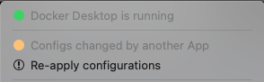

# Issue: DNS lookup fails with Docker Compose multiple networks

## Symptoms

- impacts versions of docker desktop before v2.26.1
- dataflowgen-agent is on a separate network named `data` for security
- sample error message
  > alp-dataflow-gen-agent-1 | Failed to get databases: Error: getaddrinfo ENOTFOUND alp-minerva-gateway-1
- see: https://forums.docker.com/t/docker-compose-refuses-to-attach-multiple-networks/136776/9

## Workaround

### 1 - Add dataflow-gen-agent-1 to alp network

- edit docker-compose-local.yml
- add the following to dataflow-gen-agent-1

```yaml
network:
  - alp
```

### 2 - Replace docker-compose binary

- from: https://github.com/docker/compose/issues/11533#issuecomment-2026242708
- latest release version from https://github.com/docker/compose/releases
- while docker desktop is running

```bash
NEW_VERSION=v2.24.7
[[ "$(sysctl machdep.cpu.brand_string)" =~ Intel ]] && ARCH=x86_64 || ARCH=aarch64
URL=https://github.com/docker/compose/releases/download/$NEW_VERSION/docker-compose-darwin-$ARCH
DC_PATH=~/.docker/cli-plugins/docker-compose
DC_TMP=/tmp/docker-compose

OLD_VERSION=$($DC_PATH --version | awk '{print $NF}'); echo OLD_VERSION=$OLD_VERSION
mv -vf $DC_PATH $DC_PATH.$OLD_VERSION
curl -L -o $DC_TMP $URL
chmod u+x $DC_TMP
$DC_TMP --version
cp -vf $DC_TMP $DC_PATH
cp -vf $DC_PATH $DC_PATH.$NEW_VERSION
docker compose version
```

- **Caveat**: change will revert if
  - restart docker desktop
  - click "Re-apply configurations"



## Resolution

- expected in next release of docker desktop at which time workaround#1 can be removed
- from: https://github.com/docker/compose/issues/11533#issuecomment-2034656001
- Compose v2.26.1 in Docker Desktop 4.30.0
- See the release notes for more details.
- https://docs.docker.com/desktop/release-notes/
