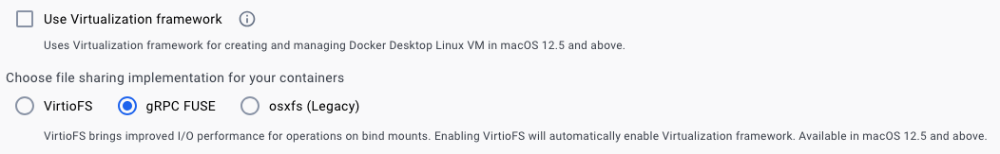

# Issue: nodejs segmentation fault on MacOS x86_64 with Virtualization Framework enabled

## Symptoms

- https://github.com/docker/for-mac/issues/6824
- affects Docker Desktop v4.19+
- sample container logs

```
docker logs --tail 1000 -f ${CONTAINER_NAME}
yarn run v1.22.22
$ ts-node updateEnvFiles.ts -s alp-minerva-db-mgmt-svc
Get client credentials token
Segmentation fault
error Command failed with exit code 139.
info Visit https://yarnpkg.com/en/docs/cli/run for
```

## Workaround

- Open Settings>General
- Uncheck **Use Virtualization framework** & select **gRPC FUSE**

> 
