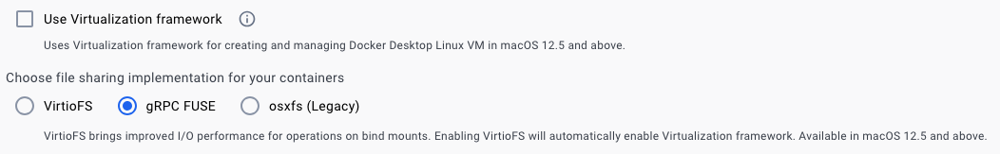

# Docker Desktop troubleshooting

## Latest Docker Compose DNS lookup fails with multiple networks
- dataflowgen-agent is on a separate network named `data` for security
- sample error message
> alp-dataflow-gen-agent-1 | Failed to get databases: Error: getaddrinfo ENOTFOUND alp-minerva-gateway-1
- see: https://forums.docker.com/t/docker-compose-refuses-to-attach-multiple-networks/136776/9
### workaround options
#### remove data network
- edit docker-compose.yml
- add the following to dataflow-gen-agent-1
```yaml
network:
  - alp
```
- remove all containers from data network by removing the string '- data'
```yaml
network:
  - data
```
#### /or/ revert to older macos Docker Desktop
- uninstall dc-desktop & install docker 4.19.0 from 2023-04-27
- download installer from https://docs.docker.com/desktop/release-notes

## Segmentation fault on x86_64 with MacOS Virtualization Framework enabled #6824
- https://github.com/docker/for-mac/issues/6824
- affects Docker Desktop v4.19+
- sample container logs
```
docker logs --tail 1000 -f ${CONTAINER_NAME}
yarn run v1.22.22
$ ts-node updateEnvFiles.ts -s alp-minerva-db-mgmt-svc
Get client credentials token
Segmentation fault
error Command failed with exit code 139.
info Visit https://yarnpkg.com/en/docs/cli/run for 
```
### Workaround 
- Open Settings>General
- Uncheck **Use Virtualization framework** & select **gRPC FUSE**

> 
