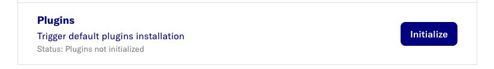
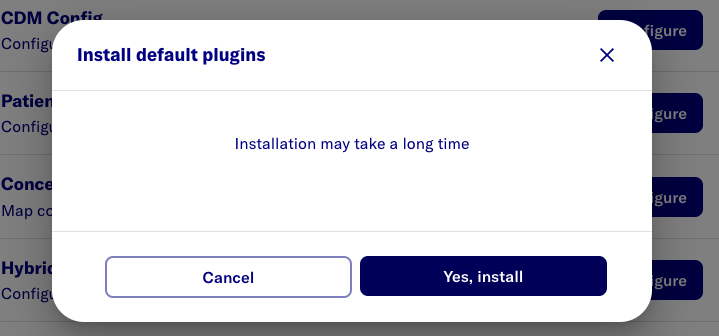

# Load Dataflow Plugins

The following plugins are currently available:
- [D2E-Plugins](https://github.com/data2evidence/d2e-flows/tree/main/flows/create_cachedb_file_plugin)

## 1-Step Upload

### Add PAT to seeded plugin url
Install the default plugins will require the PAT in order to access the private repositories.

Run below shell command once the system is up

```
pat=$(op item get "pmdwdnpwrtgmvlh5ojt53p6wki" --field password)

docker exec alp-minerva-postgres-1 psql -h localhost -U postgres -p 5432 -d alp -c "UPDATE dataflow.default_plugins SET url = regexp_replace(url, '^(https://)', 'https://${pat}@') WHERE url LIKE 'https://%' AND url NOT LIKE 'https://github_pat%' ;"

```


###  Initialize the default plugins

Switch to `setup` page.

Click the `initialize` button under `Plugin` 
> 


Confirm the upload by clicking `Yes, install` at the dialog.
> 

This will initialize all the plugins available.
