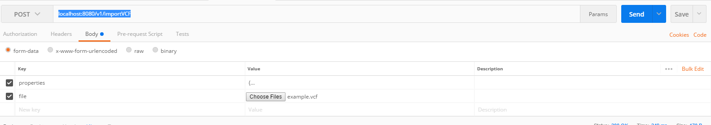

## Run to import example

mvn package

java -jar target/genomics-vcf-parser-lib-0.0.5.jar

Post a multipart Request against

**URL:** localhost:8080/v1/importVCF

**Parameter:**
  - properties to configure the import
  - file to transfer the file

**Type:** Post   


## Properties

### Fields:
|field | subfield | description|
|-----|-------------|-----|
|root | dwid | the dwid used in the import| 
| root |hana_host| hostname and port to connect hana to, e.g. localhost:30015 |
| root |hana_user| user used to connect to hana, needs write privileges on genomic tables and select on sys.tables|
| root |hana_password| password of the user|
| root |import_mapping| sub object to specify filter and sample mappings|
| import_mapping | filter_by | List containing filter expressions that must be fulfilled by a variant to be imported (or connected)
|import_mapping|import_attributes | List of Json objects describing fields to import, see example |
|import_mapping|sample_mapping | List of Json objects describing samplemapping entries, see example|
|root |technical_config| sub object to configure the hdb connection| 
|technical_config | batchsize | the maximal batch size before a commit is triggered, defaults to 20000
| technical_config| parallelCount | configures how many parallel insert jobs are running, defaults to 1
### Example

```javascript
{
    "dwid": 231423,
    "hana_host": "localhost:30015",
    "hana_user": "SYSTEM",
    "hana_password": "Toor1234",
    "import_mapping": {
        "filter_by": ["PASS"],
        "import_attributes": [{
                "type": "INFO",
                "attributes": [{
                    "name": "AA",
                    "alias": "AA"
                }, {
                    "name": "NS",
                    "alias": "NS"
                }, {
                    "name": "DB",
                    "alias": "DB"
                }]
            },
            {
                "type": "FORMAT",
                "attributes": [{
                    "name": "GT",
                    "alias": "GT"
                }]
            }
        ],
        "sample_mapping": [{
            "source_id": 1,
            "target_id": 2
        }, {
            "source_id": 2,
            "target_id": 3
        }]
    }
}
 ```


file:  the vcf file, see example:




## TODO

- StructuredVariants
- Code Cleanup
- Error Reporting
- Logging
- Split Lib from StandAlone
- TODOs
- Store unknown key/value pairs in header

- Testing
    - rollback testing
    - samplemapping
	- general
   

- Restrict import
   - only import Variants

